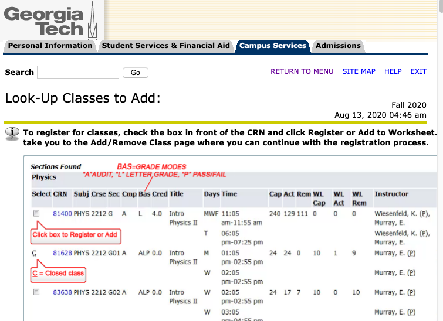

# OSCAR-OMSCS

Tool for hiding unnecessary content in OSCAR interface for OMSCS students.

## Instructions

Within the OSCAR interface, click on "Look Up Classes" and then click on "Advanced Search". Select all subjects (departments) of interest - for OMSCS students, this would be, at most, "Computational Science & Engr", "Computer Science", "Industrial & Systems Engr", and "Public Policy". Click the "Section Search" button (no need to select "Online" for Campus). You should arrive at this page:

Clicking the "O" icon in your Firefox toolbar will hide that gigantic image and all non-OMSCS classes, but should not otherwise impact the function of this interface.

## Comments/Issues

Raise them via GitHub or send them to jstevenson42@gatech.edu.
